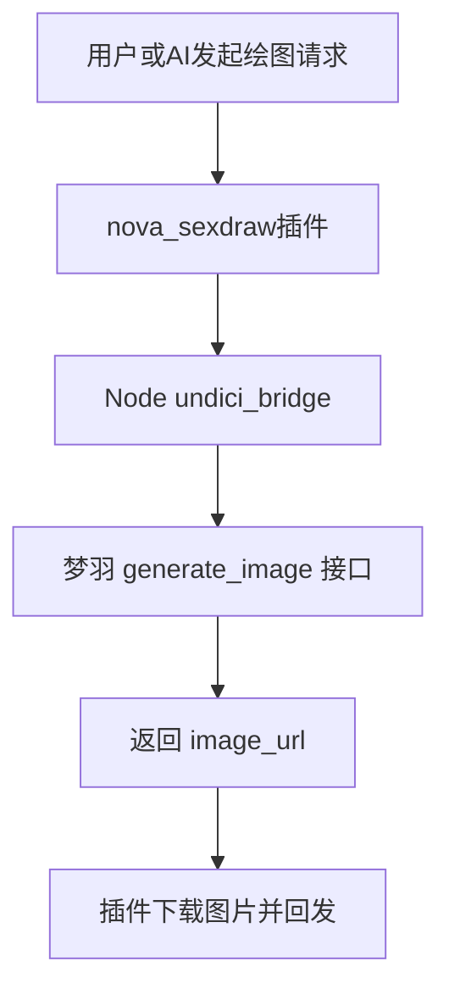

# Nova 梦羽绘图插件

梦羽 AI 绘图接口 [`/api/v1/generate_image`](AstrBot/data/plugins/astrbot_plugin_nova_sexdraw/个人中心 - 梦羽AI绘图.html:1640) 的 AstrBot 插件。

当前版本特性：

- 默认通过 Node [`undici_bridge.mjs`](AstrBot/data/plugins/astrbot_plugin_nova_sexdraw/undici_bridge.mjs) 发请求
- Python 路径仅保留为兼容/兜底逻辑
- 默认文生图模型是 `10`，也就是 wai16
- 默认步数是 `28`
- 图片编辑默认首选 `19`，也就是 `Qwen Image Edit2511版`
- 已补成更适合 AI 主动调用的“双工具结构”
- 命令里支持直接写 `model10`、`model19`
- 分辨率分隔符支持 `x`、`X`、`*`、`×`、`-`

---

## 核心能力

- 支持普通文生图
- 支持图片编辑模型
- 支持 AstrBot LLM 主动调用
- 支持 `/sexdraw`、`/色图`、`/涩图`、`/画图`
- 支持通过 QQ / 消息回复里的图片自动提取原图 URL
- 支持自定义分辨率、步数、CFG、模型索引、随机种子
- 支持代理
- 支持 NSFW

---

## 当前调用架构

当前主路径：



说明：

- 默认主调用链是 [`main.py`](AstrBot/data/plugins/astrbot_plugin_nova_sexdraw/main.py:1) -> [`undici_bridge.mjs`](AstrBot/data/plugins/astrbot_plugin_nova_sexdraw/undici_bridge.mjs)
- 代理配置 [`proxy_url`](AstrBot/data/plugins/astrbot_plugin_nova_sexdraw/_conf_schema.json:14) 会优先给 Node 桥接使用
- Python 的 [`httpx`](AstrBot/data/plugins/astrbot_plugin_nova_sexdraw/main.py:14) 路径只保留作内部兼容逻辑，不建议作为默认主路径理解

---

## AI 主动调用能力

当前插件里有三层入口：

- 主动文生图工具 [`nova_draw_image()`](AstrBot/data/plugins/astrbot_plugin_nova_sexdraw/main.py:485)
- 主动图编辑工具 [`nova_edit_image()`](AstrBot/data/plugins/astrbot_plugin_nova_sexdraw/main.py:545)
- 兼容旧调用工具 [`draw_seximage()`](AstrBot/data/plugins/astrbot_plugin_nova_sexdraw/main.py:611)

但最重要的不是“有几个工具”，而是 **什么时候允许 AI 主动调用它**。

### 允许主动调用的强信号

AI 只有在用户明确表达以下信号时，才应该优先调用这个插件。

#### 文生图强信号

- “用comfyui生图”
- “用comfyui画图”
- “用comfyui给我出一张图”
- “画个色图”
- “来张色图”
- “画个涩图”
- “来张涩图”

#### 图编辑强信号

- “用comfyui改一下这张图”
- “用comfyui把这张图改成黑发”
- “把这张色图改一下”
- “把这张涩图修一下”

### 不该主动调用的场景

如果用户只是泛泛说：

- “画张图”
- “帮我生成图片”
- “来个头像”
- “帮我改一下”

但 **没有提到 comfyui / 色图 / 涩图 / 本插件语义强信号**，那就 **不应该优先默认走这个插件**。

也就是说，这个插件现在是一个 **受限触发型绘图插件**，不是全局通用画图插件。

---

## AI 主动文生图规则

当且仅当用户明确提到：

- 用 comfyui 生图
- 用 comfyui 画图
- 画个色图
- 来张涩图

这类信号时，AI 才优先调用 [`nova_draw_image()`](AstrBot/data/plugins/astrbot_plugin_nova_sexdraw/main.py:485)。

特点：

- 面向“从零生成新图”
- 默认模型是 `10`（wai16）
- 默认步数是 `28`
- 支持 resolution 写法：`portrait` / `landscape` / `square` / `1024` / `1216x832` / `1216-832`

---

## AI 主动图编辑规则

当用户发送了图片，或者回复一张图片，并且明确提到：

- 用 comfyui 改一下这张图
- 用 comfyui 把这张图改成...
- 把这张色图改一下
- 把这张涩图修一下

这类表达时，AI 才优先调用 [`nova_edit_image()`](AstrBot/data/plugins/astrbot_plugin_nova_sexdraw/main.py:545)。

特点：

- 面向“基于原图修改”
- 默认首选模型是 `19`
- `19` 就是 `Qwen Image Edit2511版`
- 会优先自动从消息图片 / 回复图片里提取原图 URL
- 没图时会明确提示用户先发图

### 特别规则

如果语义是：

- “用comfyui改一下这张图”
- “用comfyui把这张图改成黑发”
- “用comfyui修一下这张图”

则默认走 `2511`，也就是：

```text
model19
```

---

## 当前模型逻辑

### 默认文生图模型

- `10`: `[全新模型]Wainsfw illustrious v16`
  - 当前默认文生图模型
  - 也就是 wai16

### 可选文生图模型

- `8`: `[全新模型]MiaoMiao RealSkin vPred 1.1`

### 纯图片编辑模型

以下两个模型都按“纯编辑模型”处理：

- `18`: `Qwen Image Edit版`
- `19`: `Qwen Image Edit2511版`

共同规则：

- 必须提供 `image_source`
- 请求体按编辑模式构造
- 不按普通文生图模式发送
- 不传 `steps`
- 不传 `cfg`

### 当前不支持模型

- `20`
- `21`
- `22`

以上为视频模型，当前插件仍不支持。

---

## 19 号模型实测结论

Nova 已实际测试 [`Qwen Image Edit2511版`](AstrBot/data/plugins/astrbot_plugin_nova_sexdraw/main.py:55)。

请求体：

```json
{
  "prompt": "把头发改成黑发，保持人物脸部、构图、服装和整体风格不变",
  "model_index": 19,
  "image_source": "原图URL"
}
```

成功返回：

- `status=200`
- `model_name=Qwen Image Edit2511版`
- 可获得有效 `image_url`

因此，`19` 已确定是可用的纯图片编辑模型。

---

## 配置说明

| 配置项 | 说明 | 默认值 |
|---|---|---|
| `base_url` | 梦羽站点根地址 | `https://sd.exacg.cc` |
| `api_key` | 个人中心生成的 API Key | - |
| `proxy_url` | 代理地址 | `http://127.0.0.1:7897` |
| `enable_undici_fallback` | 保留 undici 桥接能力 | `true` |
| `default_resolution` | 默认分辨率 | `512x768` |
| `default_steps` | 默认步数 | `28` |
| `default_cfg` | 默认 CFG | `7.0` |
| `default_model_index` | 默认模型索引 | `10` |
| `default_negative_prompt` | 默认负面提示词 | 内置常用负面词 |
| `timeout` | 请求超时秒数 | `180` |
| `debounce_interval` | 防抖秒数 | `15` |

---

## 分辨率怎么输入

插件当前支持两种方式。

### 1. 预设写法

直接把这些写在提示词最后：

- `portrait` -> `512x768`
- `landscape` -> `768x512`
- `square` -> `512x512`
- `1024` -> `1024x1024`

示例：

```text
/sexdraw 1girl, silver hair, red eyes portrait
/sexdraw city night landscape
```

### 2. 直接写宽高

直接写在提示词最后，分隔符支持：

- `x`
- `X`
- `*`
- `×`
- `-`

示例：

```text
/sexdraw 1girl, city night 1216x832
/sexdraw anime girl 832X1216
/sexdraw girl by sea 1216*832
/sexdraw city light 1216-832
```

补充：

- 命令入口当前解析“最后一个分辨率后缀”
- LLM 工具调用时也可以直接传 `resolution=1216x832`

---

## 模型怎么输入

现在不再强依赖 `--model=18` 这类写法。

你可以直接把模型写进 prompt 里，插件会自动提取并从 prompt 删除：

```text
/sexdraw 1girl, silver hair, red eyes model10
/sexdraw 把这张图头发改成黑发 model19
```

也就是说：

- `model10` -> 使用模型 10
- `model19` -> 使用模型 19
- 被识别后不会继续残留在真正发送给接口的 prompt 里

---

## QQ 里发图片，它怎么接收

现在插件已经补了自动取图逻辑，核心位置在 [`_extract_image_url_from_event()`](AstrBot/data/plugins/astrbot_plugin_nova_sexdraw/main.py:396)。

### 支持两种取图方式

1. 当前消息里直接带图
2. 回复一张图片后再发编辑要求

插件会：

- 先检查回复链里的图片
- 再检查当前消息里的图片
- 取第一张图片 URL 作为 `image_source`

你可以这样用：

```text
/sexdraw 把这张图头发改成黑发 model19
```

如果这条消息本身带图，或者你是回复一张图发这句命令，插件会自动把那张图当原图。

### 什么时候还需要手写 image_source

只有消息本身没有图片时，才建议手动写：

```text
/sexdraw 把头发改成黑发 model19 --image_source=https://example.com/a.png
```

---

## 命令示例

### 普通生图

```text
/sexdraw 1girl, silver hair, red eyes, beautiful portrait model10
/sexdraw city night, neon light 1216x832
/sexdraw 用comfyui画个色图，黑丝御姐，夜景 model10
```

### 图片编辑

```text
/sexdraw 把这张图头发改成黑发 model19
/sexdraw 用comfyui改一下这张图，背景换成海边 model19
```

### 手动指定原图

```text
/sexdraw 把头发改成黑发 model19 --image_source=https://example.com/input.png
```

---

## 图片编辑请求体

当前编辑模型请求体格式：

```json
{
  "prompt": "把头发改成黑发，保持人物脸部、构图、服装和整体风格不变",
  "model_index": 19,
  "image_source": "https://example.com/input_image.jpg"
}
```

补充说明：

- 编辑模型不会发送 `steps`
- 编辑模型不会发送 `cfg`
- 编辑模型也不会依赖普通文生图的宽高参数来构造请求体

---

## 当前限制

- 视频模型 `20-22` 暂不支持
- 如果图片 URL 本身带大量 shell 特殊字符，命令行手工调试时可能被 Windows cmd 截断；插件内部正常使用不受这个问题影响
- AstrBot 主体启动若有问题，仍可能是你本地 Python / 依赖环境问题，而不是本插件调用链本身的问题

---

## 版本更新

### v1.2.1

- 默认主路径调整为 Node undici 桥接
- 默认文生图模型切换为 wai16，即 `10`
- 默认步数调整为 `28`
- AI 主动调用改为“受限触发”
- 只有明确提到 `comfyui`、`色图`、`涩图` 这类强信号时才优先调用
- “用comfyui改一下这张图”默认走 `model19`
- 支持从 prompt 中提取 `model10` / `model19`
- 分辨率分隔符新增支持 `-`
- 编辑模型明确不发送 `steps/cfg`

---

## 总结

当前这版插件已经具备这些最终能力：

- 默认走 Node 桥接请求梦羽接口
- 默认文生图模型是 wai16，也就是 `10`
- 默认步数是 `28`
- `19` 号模型按纯编辑模型处理
- 编辑模型不会发送 `steps/cfg`
- AI 只会在用户明确提到 `comfyui`、`色图`、`涩图` 这类强信号时优先调用它
- 如果用户说“用comfyui改一下这张图”，默认走 `2511`，也就是模型 `19`
- 命令里支持直接写 `model10` / `model19`
- 分辨率支持 `x`、`X`、`*`、`×`、`-`
- 用户在 QQ 发图后可以直接编辑，不一定非要手写 `image_source`
- 命令入口和 LLM 工具入口同时保留